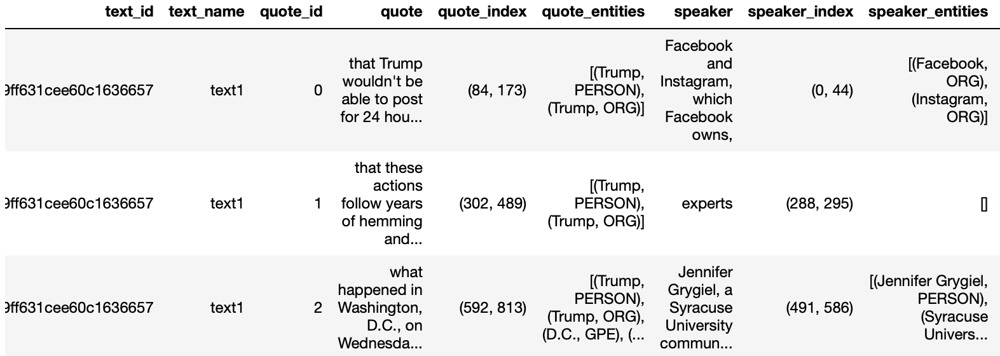

# Quotation Tool

<b>Abstract:</b> This QuotationTool can be used to extract quotes from a text. In addition to extracting the quotes, the tool also provides information about who the speakers are, the location of the quotes (and the speakers) within the text, the identified named entities, etc., which can be useful for your text analysis.

## Setup
This tool has been designed for use with minimal setup from users. You are able to run it in the cloud and any dependencies with other packages will be installed for you automatically. In order to launch and use the tool, you just need to click the below icon.

<b>Note:</b> Please try to use the first link to access the tool via BinderHub (up to 8GB memory). You can use either your AAF, Microsoft or Google credentials to login. 

1. This is the preferred link, CILogon authentication is required where you can sign in with your institutional logon or Google/Microsoft account.
  

If you are unable to access the tool via the first link above, then use the second link below. This is the free version of Binder, with less CPU and memory capacity (up to 2GB only).  

2. This link is for people without Australian institutional affiliations  
<<..Under maintenance..>>   

<b>Note:</b> this may take a few minutes to launch as Binder needs to install the dependencies for the tool.

## Load the data
<table style='margin-left: 10px'><tr>
<td>  </td>
<td>  </td>
<td>  </td>
<td>  </td>
</tr></table>

Using this tool, you can extract quotes directly from a text file (or a number of text files). Alternatively, you can also extract quotes from a text column inside your excel spreadsheet. You just need to upload your files (.txt, .xlsx or .csv) and access them via the Notebook.  

<b>Note:</b> If you have a large number of text files (more than 10MB in total), we suggest you compress (zip) them and upload the zip file instead. If you need assistance on how to compress your file, please check [the user guide](https://github.com/Australian-Text-Analytics-Platform/quotation-tool/blob/main/documents/jupyter-notebook-guide.pdf).  

## Extract and Display the Quotes
Once your files have been uploaded, you can use the QuotationTool to extract quotes from the text. The quotes, along with their metadata, will be stored in a table format inside a pandas dataframe. 

 

Additionally, using the interactive tool, you can display the text, along with the extracted quotes, speakers and named entities, on the Notebook for further analysis.

## Reference
This code has been adapted (with permission) from the [GenderGapTracker GitHub page](https://github.com/sfu-discourse-lab/GenderGapTracker/tree/master/NLP/main) and modified to run on a Jupyter Notebook. The quotation tool’s accuracy rate is evaluated in [this article](https://journals.plos.org/plosone/article?id=10.1371/journal.pone.0245533).
